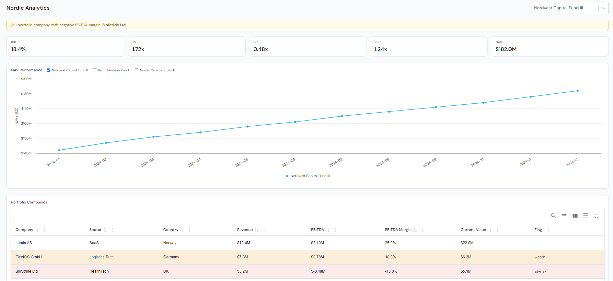

# Fund Intelligence Dashboard



## Running locally

``` bash
git clone https://github.com/SarahSolkar/nordic-dashboard.git
cd nordic-dashboard
npm install
npm run dev
```

The frontend will start on `http://localhost:5173`

## Technical decisions

- **Vite + React + TypeScript** - TypeScript was non-negotiable for a data-heavy dashboard and NAV history all fully typed catches shape mismatches at compile time rather than runtime.

- **Highcharts** - Highcharts has a first-class TypeScript API, built-in compact currency formatting, multi-series support, axis tooltip formatters that made the overlay bonus straightforward.

- **material-react-table v3** - Full control over sorting, filtering, and row-level styling declaratively. Conditional row background is a single `muiTableBodyRowProps` callback rather than custom code.

- **Tailwind CSS v4** - utility-first means zero custom CSS files.

---

## What I'd add with more time

- **Unit tests** for the formatting utilities (`fmt` in KPICards) and store logic using Vitest + Testing Library
- **Dark mode** via Tailwind `dark:` variants and a Highcharts theme toggle
- **Skeleton loading states** for the chart and table so the layout doesn't shift if data were coming from an API
- **Persisted fund selection** via `localStorage` so the selected fund survives a page refresh

---

## Known limitations

- Dataset is static and hardcoded; switching to a real API would require loading states and error handling throughout
- No error boundary around the chart; a malformed data entry would crash the panel silently
- The responsive layout is tested down to ~375px but not on true mobile touch devices
